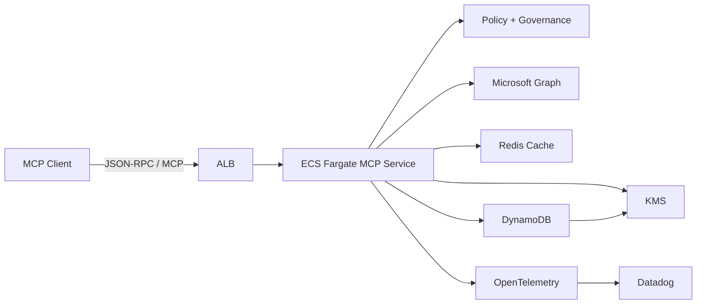
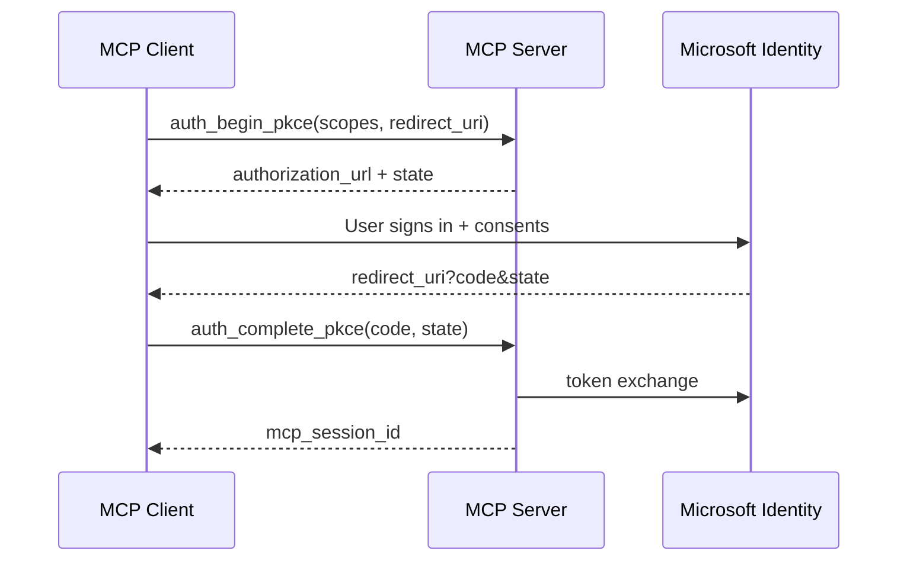

# MCP Server Design: Microsoft Graph (Mail, Calendar, OneDrive)

**Target audience:** Platform / Identity / Reliability engineers building production-grade MCP servers and agentic apps.

**Objective:** Design MCP servers (Python) that provide governed, secure, scalable access to **Email**, **Calendar**, and **OneDrive** via **Microsoft Graph**, using **OAuth2 Authorization Code + PKCE** (delegated permissions) for \~**300K users**.

---

## 1. Background and context

The Model Context Protocol (MCP) enables agentic applications to call a server’s **tools** using structured JSON inputs/outputs. This design uses MCP as the control plane and Microsoft Graph as the data plane.

**Key requirements**

- Python-based MCP server (no implementation code in this doc)
- Tools + schemas for Mail, Calendar, OneDrive
- OAuth2 with PKCE (delegated user auth)
- Production scale: 300K users, multi-tenant, resilient, observable

---

## 2. Goals and non-goals

### 2.1 Goals

- Provide a **curated** MCP tool surface (no raw Graph proxy)
- Enforce security and governance (scopes, policies, safe defaults)
- Handle Graph throttling and transient failures gracefully
- Support large-scale usage patterns (burst traffic, multi-tenant fairness)
- Provide strong auditability (who/what/when, correlation IDs)

### 2.2 Non-goals (initial scope)

- Admin-only directory operations (Entra/Directory) unless explicitly added later
- Arbitrary Graph endpoint execution (too risky for production governance)
- Full-text ingestion/sync into a separate index (can be added later)

---

## 3. System overview

### 3.1 Logical architecture

**Components**

1. **MCP Server (Python)**

   - Implements MCP protocol transport (stdio or HTTP)
   - Exposes tools for Mail/Calendar/OneDrive
   - Stateless compute layer

2. **Auth Handler (PKCE)**

   - Generates PKCE verifier/challenge and authorization URL
   - Handles redirect/callback and token exchange
   - Produces an internal **session handle** (never returns Graph tokens to clients)

3. **Token Store**

   - Durable storage for refresh tokens and user/tenant metadata
   - Encryption at rest via envelope encryption (KMS)
   - Optional: Redis hot-cache for access token and session metadata

4. **Graph Client Layer**

   - Graph SDK wrapper with centralized:
     - retries/backoff
     - throttling handling (429 / Retry-After)
     - request correlation headers
     - response normalization

5. **Policy & Governance Layer**

   - Tool-level permission mapping (scopes, policies)
   - DLP safeguards (PII minimization, safe defaults)
   - Rate-limits and quotas (per user, per tenant, per tool)

6. **Observability**

   - Structured logs, metrics, traces
   - Audit log events for side-effect tools (send, delete, share)

**Diagram: logical architecture**



### 3.2 Deployment options

- **Option A (recommended for 300K users): Remote MCP over HTTP**
  - Centralized policy enforcement, observability, and scaling
- **Option B: Local MCP (stdio) per user workstation**
  - Easier to bootstrap but harder to govern and operate at scale

This design assumes **Option A** (remote service) unless you choose otherwise later.

### 3.3 AWS deployment (ECS Fargate, single-region)

**Network and edge**
- Public ALB terminates TLS and routes to ECS service in private subnets
- Multi-AZ subnets across 2-3 AZs for HA
- Use existing VPC, ECS cluster, and ALB; Terraform provisions the ECS service only

**Compute**
- ECS Fargate service with auto-scaling on CPU/RPS/latency
- Task IAM role with least privilege for DynamoDB, Redis, KMS, Secrets Manager
- Stateless tasks; all session/token state externalized

**Region**
- Deploy to `us-east-1`

**Secrets and encryption**
- App secrets stored in AWS Secrets Manager
- KMS CMK for envelope encryption of refresh tokens and delta tokens

**Observability**
- CloudWatch logs and metrics for ECS tasks and ALB
- Structured JSON logs with correlation IDs forwarded to log analytics

### 3.4 Data storage model (DynamoDB + Redis)

**DynamoDB tables (durable)**
- `tokens`: refresh token and metadata
  - PK: `tenant_id#user_id`, SK: `client_id`
  - Attributes: encrypted refresh token, scopes, expires_at, created_at
- `sessions`: mcp_session_id binding
  - PK: `mcp_session_id`
  - Attributes: tenant_id, user_id, client_id, scopes, expires_at
- `delta_tokens`: per-user delta tokens for Mail/Drive
  - PK: `tenant_id#user_id`, SK: `domain`
  - Attributes: delta_token, updated_at
- `idempotency`: durable idempotency for write tools
  - PK: `tenant_id#user_id`, SK: `idempotency_key`
  - Attributes: tool_name, request_hash, result_hash, created_at, ttl
- `rate_limits` (optional, if Redis unavailable)
  - PK: `tenant_id`, SK: `tool_name`
  - Attributes: tokens, last_refill_at

**Capacity guidance**
- Prefer on-demand or autoscaling provisioned capacity with alarms on hot partitions.

**Access patterns**
- Store refresh token: `PutItem` into `tokens` with PK `tenant_id#user_id` and SK `client_id`.
- Fetch refresh token: `GetItem` on `tokens` by PK/SK when access token expires.
- Resolve session: `GetItem` on `sessions` by `mcp_session_id`; cache in Redis.
- Persist delta token: `PutItem` on `delta_tokens` keyed by `tenant_id#user_id` + domain.
- Read delta token: `GetItem` on `delta_tokens` by PK/SK before delta queries.
- Idempotency check: `GetItem` on `idempotency` by PK/SK; if missing, `PutItem` with TTL.
- Rate limit fallback: `UpdateItem` on `rate_limits` with conditional updates on token buckets.

**Redis (hot cache)**
- Access tokens, session metadata, idempotency hot cache, rate-limit counters
- Short TTLs; Redis is not the source of truth for tokens

---

## 4. Data flows

### 4.1 Authentication flow (OAuth2 Authorization Code + PKCE)

**Actors**: MCP Client (agentic app), MCP Server, Microsoft Identity Platform

1. Client calls `auth_begin_pkce` (scopes + redirect URI)
2. MCP Server returns `authorization_url` + `state`
3. Client opens browser → user signs in and consents
4. Microsoft redirects to `redirect_uri` with `code` + `state`
5. Client calls `auth_complete_pkce` (code + state)
6. MCP Server exchanges code for tokens, stores refresh token encrypted
7. MCP Server returns internal session binding (e.g., `mcp_session_id`)



**Important**

- Never return refresh/access tokens to the MCP client
- Prefer incremental consent (add scopes only when needed)
- Support re-auth (token revoked, CAE, conditional access changes)

### 4.2 Tool execution flow (read operations)

1. Client calls a tool (e.g., `mail_list_messages`)
2. MCP Server resolves user identity + tenant + session
3. MCP Server obtains access token (refresh if needed)
4. Call Graph with:
   - correlation headers
   - bounded page sizes
   - retry/backoff
5. Normalize Graph response to MCP output
6. Return results + pagination cursor

### 4.3 Tool execution flow (write operations)

Same as read, plus:

- idempotency support (`transaction_id` / `idempotency_key`)
- audit logging
- safety checks (policy rules)

### 4.4 Pagination model

Graph supports server-driven paging (`@odata.nextLink`) and skip tokens.

**MCP standardization**

- MCP tools accept: `{ pagination: { page_size, cursor } }`
- MCP server returns: `{ items: [...], next_cursor }`

### 4.5 Incremental sync (optional, recommended for scale)

For large mailboxes/drives, avoid repeated full scans:

- Use Graph delta queries for Mail folders and Drive items
- Persist per-user delta tokens securely

---

## 5. Security, privacy, and compliance

### 5.1 Scope strategy (least privilege)

Start with minimal delegated scopes and grow only as needed.

**Typical delegated scopes**

- Mail read/list/search: `Mail.Read` (or `Mail.ReadBasic` where feasible)
- Mail send: `Mail.Send`
- Calendar: `Calendars.Read` / `Calendars.ReadWrite`
- OneDrive: `Files.Read` / `Files.ReadWrite` (or `Files.ReadWrite.All` depending on org policy)

**Note**: Some official samples use broad scopes for simplicity; production should prefer minimal and policy-driven scopes.

### 5.2 Token handling

- Encrypt refresh tokens at rest (envelope encryption)
- Rotate encryption keys periodically
- Store minimal metadata required for refresh and correlation
- Support revocation handling (token refresh fails → re-auth required)

### 5.3 Session and client authentication to MCP

MCP client must authenticate to MCP server (independent of Graph auth). Options:

- OIDC JWT from your IdP (recommended)
- mTLS for internal services

**Decision**: Use OIDC JWT for MCP client authentication. Validate issuer, audience, and token lifetime, and map claims to tenant/user context.

### 5.4 Data minimization defaults

- Default responses return **metadata** (subject, from, dates) rather than full bodies
- Tool flags like `include_body=true` must be explicit
- Limit attachment content return; prefer OneDrive link flows for large files

### 5.5 Auditability

Emit audit events for:

- mail send, delete, move
- calendar create/update/delete/respond
- drive upload/delete/share

Audit event should include:

- user\_id, tenant\_id (pseudonymous IDs preferred)
- tool name, parameters (redacted), outcome
- correlation id and Graph request ids

---

## 6. Reliability and scalability

### 6.1 Horizontal scale

- MCP server is stateless: scale via HPA (CPU/RPS/latency)
- Use Redis for hot token/session cache and idempotency cache
- Durable DB for refresh tokens and delta tokens

### 6.2 Throttling and backoff

Graph will throttle aggressively under bursty workloads.

Implement:

- Respect `Retry-After` on 429/503
- Exponential backoff + jitter
- Per-tenant and per-user concurrency limits (bulkheads)
- Tool-level budgets (e.g., search calls are heavier)

### 6.3 Bulkhead and fairness

Separate worker pools for:

- Mail
- Calendar
- Drive So one domain cannot starve the others.

Add per-tenant fairness:

- token bucket per tenant
- priority lanes for interactive calls

### 6.4 Idempotency for writes

For side-effect tools:

- Accept `idempotency_key` (UUID)
- Cache results for a short TTL (e.g., 10–30 minutes) in Redis
- Persist idempotency keys in DynamoDB with TTL for failover safety
- For calendar event creation, pass Graph transaction IDs where supported (align with Microsoft guidance)

### 6.5 Timeouts and circuit breakers

- Tool-level deadlines (e.g., 5–15s) to protect upstream
- Circuit-break on sustained 5xx from Graph
- Fail fast with actionable errors

---

## 7. Observability

### 7.1 Metrics

- RPS, p50/p95/p99 latency per tool
- Error rate by category (auth, throttle, Graph 4xx, Graph 5xx)
- Token refresh rate and failure rate
- Graph retry counts and time spent backoff

### 7.2 Tracing

- Trace per MCP request across:
  - auth/token fetch
  - Graph call
  - normalization
- Include correlation IDs in responses for debugging

### 7.3 Logging

- Structured logs with PII redaction
- Persist Graph request IDs and throttling headers when present

---

## 8. MCP tool catalog

### 8.1 Schema conventions

- All tool inputs are JSON objects
- Date-times use ISO 8601 with timezone
- Pagination uses `{ page_size, cursor }`
- Responses return `{ items, next_cursor }` where applicable

### 8.2 Shared schema definitions

```json
{
  "Pagination": {
    "type": "object",
    "properties": {
      "page_size": { "type": "integer", "minimum": 1, "maximum": 200, "default": 25 },
      "cursor": { "type": "string", "description": "Opaque continuation token" }
    }
  },
  "DateTimeISO": {
    "type": "string",
    "description": "RFC3339/ISO-8601 datetime with timezone, e.g. 2026-01-04T10:30:00-05:00"
  },
  "Body": {
    "type": "object",
    "properties": {
      "content_type": { "type": "string", "enum": ["text", "html"], "default": "html" },
      "content": { "type": "string" }
    },
    "required": ["content"]
  },
  "Recipient": {
    "type": "object",
    "properties": {
      "email": { "type": "string" },
      "name": { "type": "string" }
    },
    "required": ["email"]
  }
}
```

---

## 9. Tools and input schemas

### 9.1 Auth tools

#### Tool: `auth_begin_pkce`

**Description:** Begin PKCE flow. Returns authorization URL and state.

```json
{
  "type": "object",
  "properties": {
    "tenant": { "type": "string", "default": "organizations" },
    "scopes": { "type": "array", "items": { "type": "string" } },
    "redirect_uri": { "type": "string" },
    "login_hint": { "type": "string" }
  },
  "required": ["scopes", "redirect_uri"]
}
```

#### Tool: `auth_complete_pkce`

**Description:** Exchange code for tokens and store securely. Returns internal session handle.

```json
{
  "type": "object",
  "properties": {
    "code": { "type": "string" },
    "state": { "type": "string" },
    "redirect_uri": { "type": "string" }
  },
  "required": ["code", "state", "redirect_uri"]
}
```

#### Tool: `auth_get_status`

**Description:** Check token presence and granted scopes.

```json
{ "type": "object", "properties": {} }
```

#### Tool: `auth_logout`

**Description:** Delete stored tokens for the session.

```json
{ "type": "object", "properties": {} }
```

---

### 9.2 Mail tools (Outlook)

#### Tool: `mail_list_folders`

```json
{
  "type": "object",
  "properties": {
    "include_hidden": { "type": "boolean", "default": false },
    "pagination": { "$ref": "#/Pagination" }
  }
}
```

#### Tool: `mail_list_messages`

```json
{
  "type": "object",
  "properties": {
    "folder_id": { "type": "string" },
    "from_datetime": { "$ref": "#/DateTimeISO" },
    "to_datetime": { "$ref": "#/DateTimeISO" },
    "unread_only": { "type": "boolean", "default": false },
    "select_fields": { "type": "array", "items": { "type": "string" } },
    "pagination": { "$ref": "#/Pagination" }
  }
}
```

#### Tool: `mail_get_message`

```json
{
  "type": "object",
  "properties": {
    "message_id": { "type": "string" },
    "include_body": { "type": "boolean", "default": true },
    "include_attachments": { "type": "boolean", "default": false }
  },
  "required": ["message_id"]
}
```

#### Tool: `mail_search_messages`

```json
{
  "type": "object",
  "properties": {
    "query": { "type": "string" },
    "folder_id": { "type": "string" },
    "requests": {
      "type": "array",
      "items": {
        "type": "object",
        "properties": {
          "query": { "type": "string" },
          "from": { "type": "integer", "minimum": 0, "default": 0 },
          "size": { "type": "integer", "minimum": 1, "maximum": 50, "default": 25 }
        },
        "required": ["query"]
      }
    },
    "pagination": { "$ref": "#/Pagination" }
  }
}
```

#### Tool: `mail_create_draft`

```json
{
  "type": "object",
  "properties": {
    "subject": { "type": "string" },
    "to": { "type": "array", "items": { "$ref": "#/Recipient" } },
    "cc": { "type": "array", "items": { "$ref": "#/Recipient" } },
    "bcc": { "type": "array", "items": { "$ref": "#/Recipient" } },
    "body": { "$ref": "#/Body" },
    "attachments": {
      "type": "array",
      "items": {
        "type": "object",
        "properties": {
          "filename": { "type": "string" },
          "content_base64": { "type": "string" },
          "content_type": { "type": "string" }
        },
        "required": ["filename", "content_base64"]
      }
    },
    "idempotency_key": { "type": "string", "description": "UUID for safe retries" }
  },
  "required": ["subject", "to", "body"]
}
```

#### Tool: `mail_send_draft`

```json
{
  "type": "object",
  "properties": {
    "draft_id": { "type": "string" },
    "idempotency_key": { "type": "string" }
  },
  "required": ["draft_id"]
}
```

#### Tool: `mail_reply`

```json
{
  "type": "object",
  "properties": {
    "message_id": { "type": "string" },
    "reply_all": { "type": "boolean", "default": false },
    "comment": { "$ref": "#/Body" },
    "idempotency_key": { "type": "string" }
  },
  "required": ["message_id", "comment"]
}
```

#### Tool: `mail_mark_read`

```json
{
  "type": "object",
  "properties": {
    "message_id": { "type": "string" },
    "is_read": { "type": "boolean" }
  },
  "required": ["message_id", "is_read"]
}
```

#### Tool: `mail_move_message`

```json
{
  "type": "object",
  "properties": {
    "message_id": { "type": "string" },
    "destination_folder_id": { "type": "string" }
  },
  "required": ["message_id", "destination_folder_id"]
}
```

#### Tool: `mail_get_attachment`

```json
{
  "type": "object",
  "properties": {
    "message_id": { "type": "string" },
    "attachment_id": { "type": "string" },
    "include_content_base64": { "type": "boolean", "default": false }
  },
  "required": ["message_id", "attachment_id"]
}
```

---

### 9.3 Calendar tools

#### Tool: `calendar_list_calendars`

```json
{ "type": "object", "properties": { "pagination": { "$ref": "#/Pagination" } } }
```

#### Tool: `calendar_list_events`

```json
{
  "type": "object",
  "properties": {
    "calendar_id": { "type": "string" },
    "start_datetime": { "$ref": "#/DateTimeISO" },
    "end_datetime": { "$ref": "#/DateTimeISO" },
    "include_cancelled": { "type": "boolean", "default": false },
    "pagination": { "$ref": "#/Pagination" }
  },
  "required": ["start_datetime", "end_datetime"]
}
```

#### Tool: `calendar_get_event`

```json
{ "type": "object", "properties": { "event_id": { "type": "string" } }, "required": ["event_id"] }
```

#### Tool: `calendar_create_event`

```json
{
  "type": "object",
  "properties": {
    "calendar_id": { "type": "string" },
    "subject": { "type": "string" },
    "body": { "$ref": "#/Body" },
    "start_datetime": { "$ref": "#/DateTimeISO" },
    "end_datetime": { "$ref": "#/DateTimeISO" },
    "timezone": { "type": "string", "default": "America/New_York" },
    "location": { "type": "string" },
    "attendees": { "type": "array", "items": { "$ref": "#/Recipient" } },
    "is_online_meeting": { "type": "boolean", "default": false },
    "online_meeting_provider": { "type": "string", "enum": ["teamsForBusiness"], "default": "teamsForBusiness" },
    "transaction_id": { "type": "string", "description": "Idempotency token for event creation" }
  },
  "required": ["subject", "start_datetime", "end_datetime"]
}
```

#### Tool: `calendar_update_event`

```json
{
  "type": "object",
  "properties": {
    "event_id": { "type": "string" },
    "patch": { "type": "object" },
    "idempotency_key": { "type": "string" }
  },
  "required": ["event_id", "patch"]
}
```

#### Tool: `calendar_delete_event`

```json
{ "type": "object", "properties": { "event_id": { "type": "string" } }, "required": ["event_id"] }
```

#### Tool: `calendar_respond_to_invite`

```json
{
  "type": "object",
  "properties": {
    "event_id": { "type": "string" },
    "response": { "type": "string", "enum": ["accept", "tentative", "decline"] },
    "comment": { "type": "string" },
    "send_response": { "type": "boolean", "default": true },
    "idempotency_key": { "type": "string" }
  },
  "required": ["event_id", "response"]
}
```

#### Tool: `calendar_find_availability`

```json
{
  "type": "object",
  "properties": {
    "attendees": { "type": "array", "items": { "$ref": "#/Recipient" } },
    "start_datetime": { "$ref": "#/DateTimeISO" },
    "end_datetime": { "$ref": "#/DateTimeISO" },
    "interval_minutes": { "type": "integer", "minimum": 5, "maximum": 60, "default": 30 }
  },
  "required": ["attendees", "start_datetime", "end_datetime"]
}
```

---

### 9.4 OneDrive tools

#### Tool: `drive_get_default`

```json
{ "type": "object", "properties": {} }
```

#### Tool: `drive_list_children`

```json
{
  "type": "object",
  "properties": {
    "drive_id": { "type": "string" },
    "item_id": { "type": "string" },
    "path": { "type": "string" },
    "pagination": { "$ref": "#/Pagination" }
  }
}
```

#### Tool: `drive_get_item`

```json
{
  "type": "object",
  "properties": {
    "drive_id": { "type": "string" },
    "item_id": { "type": "string" },
    "path": { "type": "string" }
  }
}
```

#### Tool: `drive_search`

```json
{
  "type": "object",
  "properties": {
    "drive_id": { "type": "string" },
    "query": { "type": "string" },
    "path": { "type": "string" },
    "pagination": { "$ref": "#/Pagination" }
  },
  "required": ["query"]
}
```

#### Tool: `drive_download_file`

```json
{
  "type": "object",
  "properties": {
    "drive_id": { "type": "string" },
    "item_id": { "type": "string" },
    "path": { "type": "string" },
    "return_mode": { "type": "string", "enum": ["base64", "download_url"], "default": "download_url" },
    "max_bytes": { "type": "integer", "minimum": 1, "maximum": 104857600, "default": 104857600 }
  }
}
```

#### Tool: `drive_upload_small_file`

```json
{
  "type": "object",
  "properties": {
    "drive_id": { "type": "string" },
    "parent_path": { "type": "string", "default": "/" },
    "filename": { "type": "string" },
    "content_base64": { "type": "string" },
    "conflict_behavior": { "type": "string", "enum": ["fail", "replace", "rename"], "default": "rename" },
    "idempotency_key": { "type": "string" }
  },
  "required": ["filename", "content_base64"]
}
```

#### Tool: `drive_create_folder`

```json
{
  "type": "object",
  "properties": {
    "drive_id": { "type": "string" },
    "parent_path": { "type": "string", "default": "/" },
    "folder_name": { "type": "string" },
    "conflict_behavior": { "type": "string", "enum": ["fail", "replace", "rename"], "default": "rename" }
  },
  "required": ["folder_name"]
}
```

#### Tool: `drive_delete_item`

```json
{
  "type": "object",
  "properties": {
    "drive_id": { "type": "string" },
    "item_id": { "type": "string" },
    "path": { "type": "string" }
  }
}
```

#### Tool: `drive_share_create_link`

```json
{
  "type": "object",
  "properties": {
    "drive_id": { "type": "string" },
    "item_id": { "type": "string" },
    "path": { "type": "string" },
    "link_type": { "type": "string", "enum": ["view", "edit"], "default": "view" },
    "scope": { "type": "string", "enum": ["anonymous", "organization"], "default": "organization" }
  }
}
```

---

### 9.5 Platform tools

#### Tool: `system_health`

```json
{ "type": "object", "properties": {} }
```

#### Tool: `system_whoami`

```json
{ "type": "object", "properties": {} }
```

---

## 10. Error model (recommended)

Return structured errors so agentic apps can recover.

**Error categories**

- `AUTH_REQUIRED` (no tokens)
- `CONSENT_REQUIRED` (missing scopes)
- `FORBIDDEN_POLICY` (blocked by org policy)
- `THROTTLED` (429 with retry\_after)
- `UPSTREAM_ERROR` (Graph 5xx)
- `INVALID_INPUT` (schema failure)

Include:

- `correlation_id`
- `retry_after_seconds` when throttled

---

## 11. Operational readiness

### 11.1 SLOs (example)

- Availability: 99.9%
- p95 latency: < 1.5s for list/get; < 3s for search
- Error budget partitioned by tool family

### 11.2 Load and capacity

- Use per-tenant concurrency caps
- Cache frequent reads (folders, calendars) with short TTL
- Prefer delta queries for sustained usage

### 11.3 Disaster recovery

- Multi-AZ DB
- Backups and restore testing
- Key rotation playbooks

---

## 12. Testing strategy

- Unit tests for schema validation and normalization
- Contract tests against Graph (mock + optional live tenant)
- CI runs ruff/pytest and builds the Docker image
- Chaos testing for throttling and token revocation
- Security tests: token encryption, redaction, access controls

---

## 13. Open questions / decisions to finalize

1. MCP transport: HTTP vs stdio (recommend HTTP for 300K)
2. Tenant model: single-tenant vs multi-tenant app registration
3. Scope policy: minimal baseline and escalation process
4. Storage choices: Postgres vs DynamoDB; Redis availability tier
5. Data retention: audit log retention and PII redaction rules

---

## Appendix A — Sources researched

(Links listed in a code block for easy copy/paste.)

```text
Open-source MCP servers / implementations
- https://github.com/Softeria/ms-365-mcp-server
- https://github.com/microsoft/files-mcp-server
- https://github.com/ryaker/outlook-mcp
- https://github.com/hvkshetry/office-365-mcp-server
- https://github.com/anoopt/outlook-meetings-scheduler-mcp-server
- https://github.com/merill/lokka
- https://github.com/pnp/cli-microsoft365-mcp-server
- https://github.com/DynamicEndpoints/m365-core-mcp
- https://github.com/Norcim133/OutlookMCPServer

Microsoft documentation
- https://learn.microsoft.com/en-us/microsoft-agent-365/mcp-server-reference/mail
- https://learn.microsoft.com/en-us/microsoft-agent-365/mcp-server-reference/calendar
- https://learn.microsoft.com/en-us/graph/

Discovery / ecosystem
- https://github.com/microsoft/mcp
- https://github.com/MicrosoftDocs/mcp
```


-

## 14. Implementation decisions (recorded)

- **MCP Python SDK + transport:** Use **HTTP** transport (not stdio) for centralized governance, observability, and horizontal scaling. Let’s use the official python MCP SDK available at [https://github.com/modelcontextprotocol/python-sdk](https://github.com/modelcontextprotocol/python-sdk)

- **Token storage and encryption:** Store refresh tokens and auth metadata in **DynamoDB**, with **Redis (ElastiCache)** as a hot cache for session/access-token metadata and idempotency keys. Encrypt sensitive fields using **application-level encryption (ALE)** with envelope keys managed by KMS.

- **Graph client wrapper:** Implement a thin wrapper around the Microsoft Graph SDK that standardizes retries/backoff, throttling handling (429/Retry-After), timeouts, correlation IDs, and response normalization.
