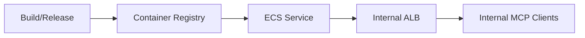

# Operations and Runbooks

This document covers operational practices for the MCP server.

---

## Deployment

- Deploy as a stateless HTTP service behind a load balancer.
- Separate environments: dev, test, preprod, prod.
- Blue/green or canary rollout for client wrapper changes.
- Configuration via environment variables and secret manager references.
- ECS Fargate service behind ALB in multi-AZ subnets.
- Task IAM role with least-privilege access to DynamoDB, Redis, KMS, Secrets Manager.
- Use existing VPC, ECS cluster, and ALB; Terraform provisions the ECS service only.
- Container images are pulled from an existing registry (no ECR provisioning).

---

## Configuration

**Required config**
- Microsoft Entra app registration IDs and redirect URIs
- Allowed tenants and consent policy
- KMS key IDs for token encryption
- DynamoDB and Redis endpoints
- Rate-limit and concurrency settings
---

## Observability

**Metrics**
- RPS and latency by tool
- Error rate by category
- Token refresh rate and failures
- Retry counts and time in backoff

**Logs**
- Structured JSON logs with PII redaction
- Correlation IDs for all tool calls
- Graph request IDs when present

**Tracing**
- End-to-end traces across auth, token refresh, Graph calls, normalization
- OpenTelemetry instrumentation with Datadog exporter

---

## Alerts

- Elevated 4xx/5xx rates per tool family
- Sustained throttling spikes
- Token refresh failure rate
- Redis/DynamoDB latency or error spikes
- Circuit breaker open events

---

## Security operations

- Rotate KMS keys on a defined cadence.
- Support token revocation and re-auth flows.
- Audit log retention policy (configurable).
- Incident response for token leakage or policy bypass.

---

## Incident response checklist

1. Identify affected tool family and tenant.
2. Check throttling and upstream Graph status.
3. Validate auth token refresh rates and cache health.
4. Review recent deploys and configuration changes.
5. Mitigate with traffic shaping or feature flags.

---

## Runbooks (common failure modes)

**Graph regional degradation**
- Detect sustained 429/5xx spikes and elevated latency.
- Lower concurrency limits and increase backoff.
- Enable feature flags to disable heavy tools (search, large list).

**DynamoDB throttling**
- Detect `ProvisionedThroughputExceeded` and elevated latency.
- Temporarily scale RCU/WCU and reduce token refresh burst by staggering.
- Validate hot partition patterns in `tokens` and `idempotency` tables.

**Redis failover or cache loss**
- Expect token refresh spike; activate singleflight/locking.
- Fall back to DynamoDB for session and idempotency lookups.
- Reduce request concurrency until cache warms.

**Token refresh storm**
- Detect elevated refresh failures or spikes in refresh RPS.
- Apply per-tenant backoff and gradual re-auth prompts.
- Validate time skew and KMS latency.

---

## Backups and recovery

- DynamoDB point-in-time recovery enabled.
- Redis persistence strategy defined per environment.
- Quarterly restore drills with validation.

---

## Load testing

- Use Locust for load tests targeting key tool flows (list, search, send, upload).

---

## Parking lot

- Long-term audit log storage in S3 with lifecycle policies and retention controls.
- Finalize rate-limiting policy (per-tenant/per-user limits, bursts, backoff rules).
- Confirm large file upload chunk sizing and resume behavior expectations.
- Standardize MCP error taxonomy and response shape.
- Confirm per-tool SLO targets and error budget tracking.
- Bind MCP sessions to OIDC identity claims (e.g., `sub`/`oid`) and enforce per-request matching.
- Implement `auth_logout` to revoke/delete session, refresh token, and cache entries.
- URL-encode PKCE parameters and validate/lock redirect URIs to prevent tampering.
- Preserve scopes during refresh token flows and persist updated refresh tokens/expiry.
- Validate ALB/ECS request size/timeouts for 100 MB base64 payloads; consider reducing base64 cap and using upload sessions for large files.
- Implement OneDrive upload session chunk handling with binary PUT, `Content-Range`, and `Content-Type: application/octet-stream`.
