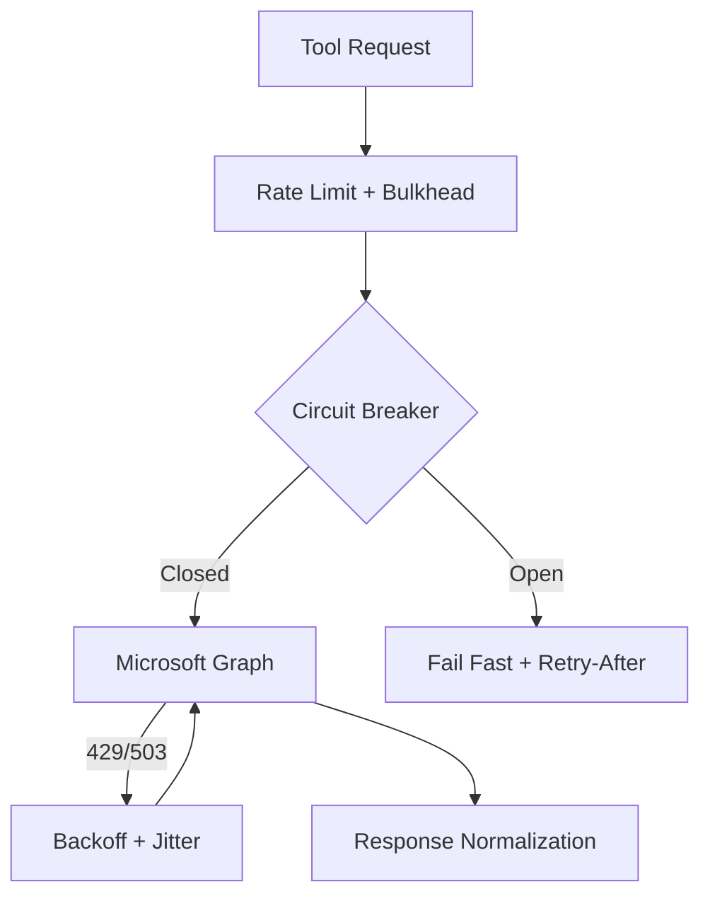

# Resiliency and Scaling

This document captures reliability, throttling, and scaling strategies for the MCP server at ~300K users.

---

## Capacity model

- **Stateless MCP server** with horizontal scaling (HPA by CPU/RPS/latency).
- **Redis cache** for access tokens, refresh tokens, session metadata, and idempotency keys.
- **Bulkheads** by domain (Mail, Calendar, Drive) to prevent cross-domain starvation.

**Redis deployment guidance (single region)**
- Use Redis in cluster mode with replicas (multi-AZ)
- Enable automatic failover and set eviction to `volatile-ttl`
- Apply short TTLs to session and token entries (minutes, not hours)
- Use singleflight/locking to avoid cache stampede on token refresh

---

## Throttling and backoff

Microsoft Graph throttles aggressively. The client wrapper must:

- Respect `Retry-After` for 429/503.
- Use exponential backoff with jitter for transient 5xx.
- Enforce per-tenant and per-user concurrency limits.
- Apply tool-level budgets (search and large list calls are heavier).

---

## Timeouts and circuit breakers

- Per-tool timeouts (5-15s typical).
- Circuit breakers on sustained upstream 5xx or timeout spikes.
- Fail fast with structured errors so clients can retry safely.

---

## Idempotency

- Write tools accept `idempotency_key` or `transaction_id`.
- Cache results in Redis for 10-30 minutes.
- Idempotency keys are stored in Redis with TTL.
- Use Graph transaction IDs where supported (e.g., event creation).

---

## Pagination

- Standardize on `{ page_size, cursor }` inputs and `next_cursor` outputs.
- Enforce bounded page sizes (default 25, max 200) to reduce throttling.
- Use Graph `@odata.nextLink` and `skiptoken` to drive cursors.

---

## Incremental sync (optional)

- Use delta queries for Mail and Drive to avoid repeated full scans.
- Store delta tokens per user in Redis (best-effort).

---

## Fairness and QoS

- Token-bucket per tenant.
- Priority lanes for interactive calls vs batch.
- Separate worker pools for read vs write tools.
- Rate-limit enforcement backed by Redis.

---

## Caching

- Cache folder lists, calendars, and drive metadata with short TTL.
- Never cache sensitive message bodies unless explicitly requested.
- Cache keys must include tenant, user, and tool version.

---

## Failure modes and responses

- **Auth failure**: return `AUTH_REQUIRED` or `CONSENT_REQUIRED`.
- **Throttled**: return `THROTTLED` with `retry_after_seconds`.
- **Upstream error**: return `UPSTREAM_ERROR` with correlation ID.

---

## Scaling targets

- p95 latency: < 1.5s for list/get, < 3s for search.
- Availability: 99.9%.
- Error budget allocated by tool family to reflect criticality.

## SLOs and error budgets

- Availability SLO: 99.9% monthly for read tools, 99.95% for write tools.
- Latency SLO: p95 <= 1.5s (read), p95 <= 3s (search), p95 <= 5s (write).
- Error budget burn alerts at 2x and 5x normal burn rates.
